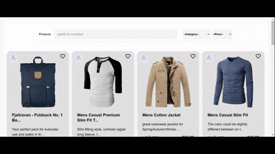
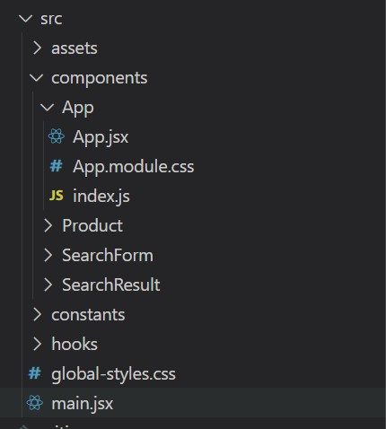

## Product Catalog App Preview 🚀

Hey there! Welcome to my **Product Catalog** project : a small, fun React app where you can browse products, find your favorites, and play around with filters and sorting. Here's what it does:

- **Fetches product data** from [Fake Store API](https://fakestoreapi.com/products) !
- **Displays products** in a neat, responsive grid. Each card shows:
  - Title
  - Price
  - Category
  - Image
- **Filter by category** : because who wants to scroll through everything?
- **Sort by price** : low to high, high to low.
- **Favorite products** : click the heart, make it yours.
- **Search bar** : find what you’re looking for in a snap.
- **Responsive design** : works nicely on desktop, tablet, or even smaller screens.

All of this is done in **React** with **hooks**, clean components.

Check it out and enjoy exploring products! 🛒

## Setup Instructions

Follow these steps to get the app running locally:

1. **Clone the repo:**

git clone https://github.com/karimahamdan12/React-Assignment-Product-Catalog-App.git

2. **open the project:**

cd React-Assignment-Product-Catalog-App

3. **install dependencies:**

npm install

4. **Run the app locally:**

npm run dev

## Demo

here's a quick demo for the app.

## Quick Notes On design decisions

## 🧩 Design Decision — Directory Structure & Organization

In terms of organization, I wanted the project structure to be intuitive and function-oriented.  
Each directory corresponds to a specific responsibility:

### 📁 Folder Breakdown

- **`components/`** — contains all reusable UI components.  
  Each component has its own subdirectory that includes:

  - a dedicated **CSS Module** file for scoped styling
  - a **barrel file** (`index.js`) to simplify imports across the app

  This approach keeps the codebase clean and avoids style conflicts between components.

- **`hooks/`** — contains all custom React hooks that encapsulate logic shared across components.

- **`global-styles.css`** — a single stylesheet for **global rules** (e.g., color variables, layout resets, and typography).  
  This file ensures visual consistency throughout the application.

---

💡 **Goal:** Maintain a modular and scalable structure where each element has a clear purpose and can evolve independently.

### Component design

i choosed SelectDropDown cause i think he got some nice decisions and reasoning

### SelectDropDown Component

The `SelectDropDown` is one of those “brick-level” components that I like to make **highly reusable and flexible**. The idea here is simple: I wanted a dropdown that can be used anywhere in the app (like for category or sort selection) **without rewriting the same logic over and over**.

Here’s what makes it special:

- **Give the consumer just enough power** You can pass any valid `<select>` props (`onChange`, `value`, `disabled`, etc.) using `{...delegated}`. This means the parent component controls behavior, but can’t accidentally break the built-in styles.
- **Built-in styles, plus flexibility** The component uses default styles from `SelectDropDown.module.css` while still allowing extra classes via `className`. This keeps it visually consistent across the app.
- **Reusability without compromise** Whether it’s a category dropdown or a sort-by-price dropdown, the same component works everywhere, making the codebase cleaner and easier to maintain.

> TL;DR: It’s a simple, reusable, and flexible dropdown that balances **control** for the consumer with **safeguards for design consistency**.

## Performance

To make the app feel fast and responsive, I made a few key decisions:

- **Lazy-loading images** – Images only load when they enter the viewport, which reduces initial load time and saves bandwidth.
- **`SelectDropDown` as a pure component** – By wrapping it in `React.memo`, it only re-renders when one of its props changes. This avoids unnecessary re-renders and keeps the UI snappy, especially when the dropdown is used multiple times on the page.

## What Could Have Been Improved If I Had More Time

### Add Pagination

Currently, the project deals with only a few images, so performance isn’t an issue.  
However, for larger datasets, implementing pagination would improve usability and reduce load times.

### Use WebP Images

Using WebP instead of PNG would make images lighter and faster to load, improving performance and reducing bandwidth usage.

### Add TypeScript

For better type safety and control over data structures, TypeScript would have been a great addition. For now, the focus was on implementing core functionalities.

### Automated Tests

Currently, i don't have enough time to write tests so the testing was done manually. For larger applications, automated tests (unit and integration tests) would ensure reliability and make future maintenance easier.
